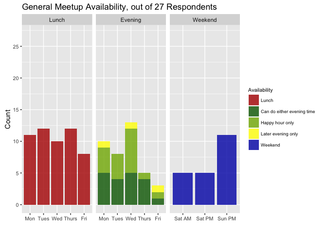
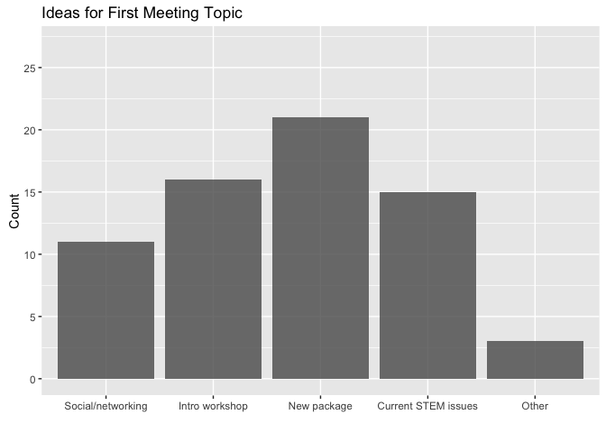
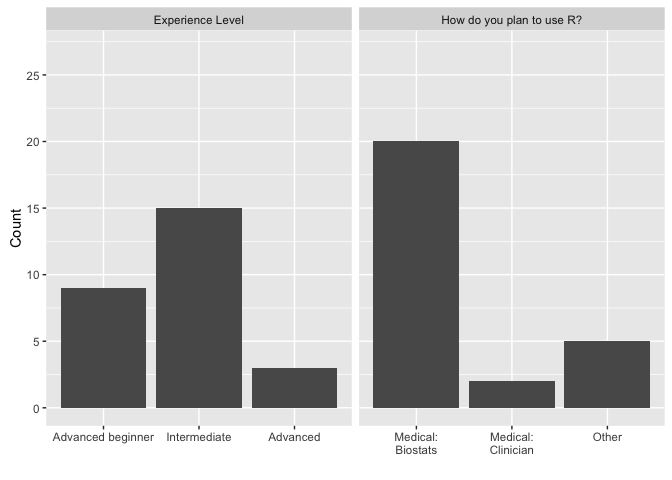

R-Ladies Nashville Kickoff Survey
================

``` r
knitr::opts_chunk$set(message = FALSE, warning = FALSE, echo = FALSE)
```

Thank you all for your input! Below is a summary of responses from the R-Ladies Nashville kickoff survey.

Meeting Times
-------------



Preferences for Kickoff Meeting
===============================



### Ideas for "other" topics:

-   Codes examples for graphics,analysis or simulations; Reproducible research advances
-   How to involve girls (school age) in programing and other tech activities.
-   advanced topics...whatever

<!-- end of list -->
### Specific package ideas:

-   dplyr, data table, matching causal inference and machine learning packages
-   tidyr/dplyr
-   Tidyverse
-   no
-   data.table
-   data.table

<!-- end of list -->
Meeting Venue Ideas
===================

-   You might reach out to this group and see if they have R users: <http://nashvillewomenprogrammers.com/>
-   Emma (?)
-   Atamology?
-   Atmalogy has a "boardroom" space available for rent that fits 16 people, in terms of off-campus venues!
-   Plan ahead, for a date and depending on how many rsvp --Coffee shops if small group or even dining place --Large group vanderbilt biostatistics large conference room if it is possible
-   Coffee shop!
-   Vanderbilt SRC There are also meeting rooms in green hills that are available on a per hour basis
-   Maybe main campus Vanderbilt would have some good conference room spaces. University club or Student center. Not sure if they're expensive.
-   8th floor of 2525 West End Avenue.

<!-- end of list -->
R-Ladies Demographics
=====================



Thanks to our 14 ladies who are interested in serving on the planning committee!
